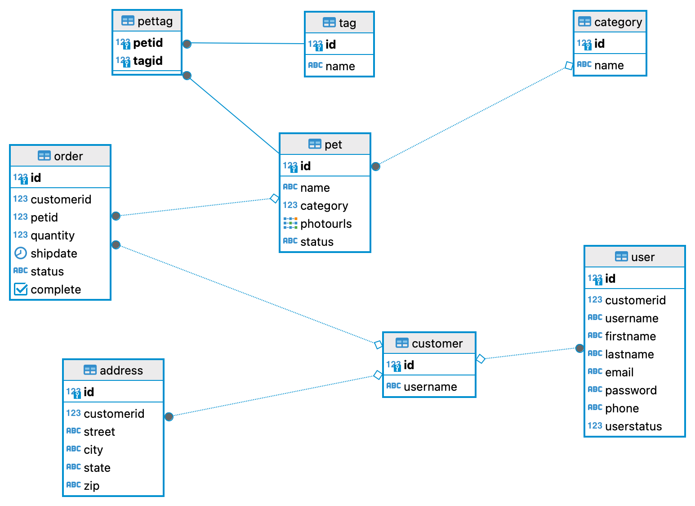
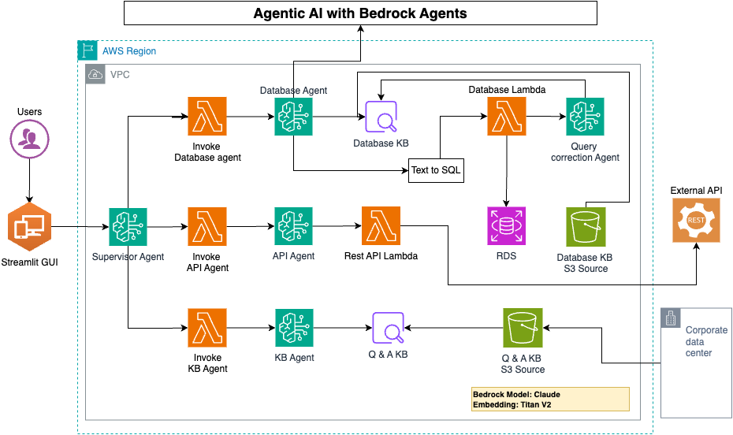

# Agentic AI with Bedrock Agents

This repository demonstrates the architecture and implementation of an agent-based AI system using AWS Bedrock Agents and the Claude model. The architecture leverages AWS Lambda, S3, and RDS, and uses a variety of agents (Database Agent, API Agent, KB Agent) to provide an interactive and functional AI-driven experience. The architecture is depicted in the image `AgenticDemo.png`.

## Architecture Overview

### Components:
1. **Users and GUI**: End-users interact with the system through a graphical interface (Agent GUI), initiating queries and requests.
   
2. **Agents**:
   - **Database Agent**: Interacts with the database to retrieve and update information.
   - **API Agent**: Handles communication with APIs via REST API Lambda.
   - **KB Agent**: Manages knowledge base interactions, with access to a Q&A KB sourced in S3.
   - **Query Correction Agent**: Automatically corrects SQL queries to ensure they are processed correctly. This agent helps improve the accuracy of database interactions by refining and adjusting gernrated SQL query as needed.

3. **AWS Lambda**:
   - **Rest API Lambda**: Executes API requests and interacts with RDS for database operations.
   - **Database Lambda**: Executes SQL, enabling dynamic database interactions. It also works alongside the Query Correction Agent to ensure queries are valid.

4. **Data Sources**:
   - **RDS**: The primary database.
   - **S3 Sources**: Data is stored in S3 for both the database knowledge base and Q&A knowledge base.
   - **Database Structure**: 

5. **Bedrock Model - Claude**: The system leverages Claude as the model for natural language understanding and interaction with the agents.

### Flow:
Users make requests through the GUI, which are handled by the corresponding agents. Depending on the request type (Database, API, or Knowledge Base), Bedrock will invoke appropriate AWS Lambda functions from the action group to process the request, interacting with the underlying data sources and generating responses that are then returned to the users. The Query Correction Agent ensures reivew the user question, existing SQL query and the query execution error to update the SQL query for Database Lambda.



## Project Structure

- `apps/`
  - **streamlit/**: Contains the Streamlit app code, likely providing the GUI for the agents.
  - **agents/**: Likely holds the agent logic (Database Agent, API Agent, KB Agent).
  
- `cicd/`
  - This folder appears to be for CI/CD-related resources, although it is currently empty.
  
- `images/`
  - **AgenticDemo.png**: The architecture diagram for the project.
  - **AgenticDemo.drawio**: The editable diagram file.

- `integration/`
  - **ddl.sql**: Database definition script.
  - **data.sql**: Initial dataset for the project.
  - **petstore.yaml**: API specification in OpenAPI format.
  - **petstore_data_dictionary.md**: Data dictionary for the API.

- `lambdas/`
  - **text-to-sql-function/**: Lambda function for executing SQL queries, used by database agent.
  - **layer/**: Lambda layers to connect to database.
  - **rest-api-function/**: Lambda function for handling REST API requests.

## Setup Instructions

1. **Clone the Repository**:
   ```bash
   git clone https://github.com/wchemz/AgenticDemo.git
   cd AgenticDemo
   ```

2. **Set up the Database**:
   - Use the SQL files in the `integration/` folder to set up the RDS instance.
     - `ddl.sql` - Defines the schema.
     - `data.sql` - Populates the database with sample data.

3. **Deploy Lambda Functions**:
   - Navigate to the `lambdas/` directory and deploy the necessary Lambda functions (`text-to-sql-function` and `rest-api-function`).

4. **Set up the Streamlit App**:
   - The `apps/streamlit/` folder contains the Streamlit application that serves the GUI for user interaction.
   - Run the app locally using:
     ```bash
     python -m streamlit run apps/streamlit/agents.py
     ```

5. **Configure AWS Services**:
   - Ensure your AWS environment is set up with the appropriate IAM roles and permissions for Lambda, RDS, and S3 access.

## Usage

Once the system is set up, users can interact with the agents via the GUI. Queries are processed and sent to the appropriate agent for resolution. The system supports various functionalities, including:
- Text-to-SQL query conversion for database interaction.
- REST API handling for external integrations.
- Knowledge base queries for fetching information stored in the Q&A database.
- Automatic query correction to improve the accuracy of database queries.

## License

This project is licensed under the MIT License.
